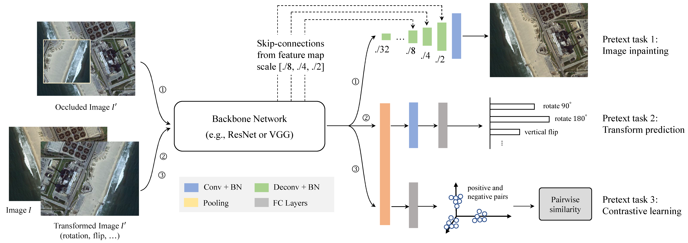

# Overview.
__Self-supervised Multi-task Representation Learningfor Remote Sensing Images
[Paper]()__

Deep learning-based image analysis typically follows a network pre-training + fine-tuning paradigm. In the pre-training stage, large scale labeled datasets (like ImageNet) are required, but they are usually very difficult to obtain. To ease the burden of data annotation, self-supervised visual representation learning emerged recently. However, the methods designed for natural images may not naturally suitable to remote sensing images due to their discrepancy in image contents and characteristics. In this paper, we propose a self-supervised multi-task representation learning method for learning effective visual representations of remote sensing images. We bridge the gap between the pre-training and the downstream tasks by designing a triplet Siamese network to learn the high-level image features and low-level image features at the same time. By using our method, the pre-training of a backbone networks on remote sensing data does not require any manual annotations. Experimental results show that by comparing with ImageNet pretrained models, our method achieves comparable accuracy in the downstream task of scene classification task and higher accuracy in semantic segmentation. Our method also outperforms the recent state of the art self-supervised representation learning methods in both of the scene classification and semantic segmentation.



In this repository, we implement the training of self-supervised multi-task representation learning for remote sensing images with pytorch and generate pretrained models. With the code, you can also try on your own dataset by following the instructions below.


# Requriements

- python 3.6.7

- pytorch 1.5.0

- torchvision 0.6.0

- cuda 10.1

See also in [Requirements.txt](requirements.txt).

# Setup

1. Clone this repo.

   `git clone https://github.com/flyakon/SSLRemoteSensing.git`

   `cd SSLRemoteSensing`

2. Prepare the training data and put it into the specified folder, such as ".. / dataset / train_ data".

3. Modify the configs file [vr_vgg16_inapinting_agr_examplar_cfg.py](configs/vr_vgg16_inapinting_agr_examplar_cfg.py) to configure the training parameters.

   Some important training parameters:

   ```_
   backbone_cfg: which network ("vgg16_bn" or "resnet50 ") to choose as the backbone.
   inpainting_head_cfg, agr_head_cfg and examplar_head_cfg: network parameters corresponding to different pretext tasks.
   train_cfg: parameters corresponding to self-supervised representation learning.
   ```

4. Change the "--config_file" option to the location of   [vr_vgg16_inapinting_agr_examplar_cfg.py](configs/vr_vgg16_inapinting_agr_examplar_cfg.py) in [train.py](train.py) and run this file.

# Citation

If you find the code useful, please cite:

``````
@InProceedings{
}
``````